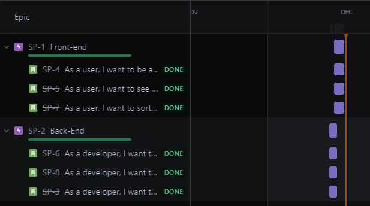
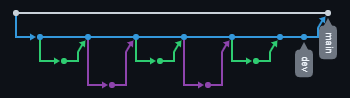

# Spring Project ReadMe

I planned my project using Jira. I created user stories and then used them to direct the project. 

I also used sprints as a way to manage my time.

I used git for my CI and GitHub to hold the repositories. I created two, one for the frontend and documentation, and 
the other for the backend. 

The image below shows the feature-branch model from the backend repository.

For the databases I used MySQL workbench for the persistent one that held the user entered data, and H2 with scheme and
data files for the temporary testing databases used by MockMVC.

The backend was created in Java using the Spring Boot framework. Integration testing was also done through the framework
using MockMVC.

The frontend is built using HTML and Javascript, with Bootstrap used for the basic styling.